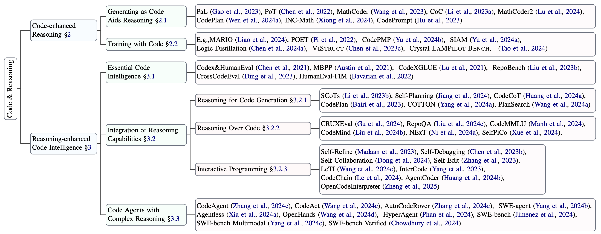

# A Survey on Code Reasoning
This is the official repository of our paper: **Code to Think, Think to Code: A Survey on Code-Enhanced Reasoning and Reasoning-Driven Code Intelligence in LLMs**


[](https://arxiv.org/abs/2502.19411) 
[](https://arxiv.org/abs/2502.19411) 
[](http://makeapullrequest.com)
[](https://awesome.re/)
<!--  -->
[](https://arxiv.org/abs/2502.19411)

<p align="center" width="100%">
  
  <br>
  Taxonomy of interplay between Code and Reasoning
</p>


*Please do not hesitate to contact us or launch pull requests if you find any related papers that are missing in our paper, and let us know if you discover any mistakes or have suggestions by emailing us: yangdayu1997@gmail.com*


## News 📰
- Update on 2025/02/27: Paper is released on arXiv. [](https://arxiv.org/abs/2502.19411)
- Update on 2025/02/11: Updating Reading Lists 📖


## Citation 📖

🫶 If you are interested in our work or find this repository helpful, please consider using the following citation format when referencing our paper:

```bibtex
@article{yang2025codereasoning,
  title={Code to Think, Think to Code: A Survey on Code-Enhanced Reasoning and Reasoning-Driven Code Intelligence in LLMs},
  author={Yang, Dayu and Liu, Tianyang and Zhang, Daoan and others},
  journal={arXiv preprint arXiv:2502.19411},
  year={2025}
}
```


## Acknowledgements

This is an open collaborative research project among:

<div style="display: flex !important; flex-wrap: nowrap; gap: 15px; align-items: center; justify-content: center; width: 100%;">
    <a href="https://ai.meta.com/">
        
    </a>
    <a href="https://ucsd.edu/">
        
    </a>
    <a href="https://www.rochester.edu">
        
    </a>
</div>


## Contributors

Following the release of this paper, we have received numerous valuable comments from our readers. We sincerely thank those who have reached out with constructive suggestions and feedback.

This repository is actively maintained, and we welcome your contributions! If you have any questions about this list of resources, please feel free to contact me at `yangdayu1997@gmail.com`.


## Table Of Contents


- [A Survey on Code Reasoning](#a-survey-on-code-reasoning)
  - [News 📰](#news-)
  - [Citation 📖](#citation-)
  - [Acknowledgements](#acknowledgements)
  - [Contributors](#contributors)
  - [Table Of Contents](#table-of-contents)
  - [Code-aided Reasoning](#code-aided-reasoning)
    - [Generating as Code](#generating-as-code)
    - [Training with Code](#training-with-code)
  - [Reasoning-enhanced Code Intelligence](#reasoning-enhanced-code-intelligence)
    - [Essential Code Intelligence](#essential-code-intelligence)
    - [Integration of Reasoning Capabilities](#integration-of-reasoning-capabilities)
      - [Reasoning for Code Generation](#reasoning-for-code-generation)
      - [Reasoning Over Code](#reasoning-over-code)
      - [Interactive Programming](#interactive-programming)
    - [Code Agents with Complex Reasoning](#code-agents-with-complex-reasoning)


## Code-aided Reasoning

### Generating as Code

| Paper Title | URL | Release Date |
|------------|-----|--------------|
| PAL: Program-aided Language Models | https://arxiv.org/abs/2211.10435 | 2022-11-18 |
| Program of Thoughts Prompting: Disentangling Computation from Reasoning for Numerical Reasoning Tasks | https://arxiv.org/abs/2211.12588 | 2022-11-22 |
| Chain of Code: Reasoning with a Language Model-Augmented Code Emulator | https://arxiv.org/abs/2312.04474 | 2023-12-07 |
| Program-Aided Reasoners (better) Know What They Know | https://arxiv.org/abs/2311.09553 | 2023-11-16 |
| When Do Program-of-Thoughts Work for Reasoning? | https://arxiv.org/abs/2308.15452 | 2023-08-29 |
| MathCoder: Seamless Code Integration in LLMs for Enhanced Mathematical Reasoning | https://arxiv.org/abs/2310.03731 | 2023-10-05 |
| MathCoder2: Better Math Reasoning from Continued Pretraining on Model-translated Mathematical Code | https://arxiv.org/abs/2410.08196 | 2024-10-10 |
| Code Prompting Elicits Conditional Reasoning Abilities in Text+Code LLMs | https://arxiv.org/abs/2401.10065 | 2024-01-18 |
| Steering Large Language Models between Code Execution and Textual Reasoning | https://arxiv.org/abs/2410.03524 | 2024-10-04 |
| Interactive and Expressive Code-Augmented Planning with Large Language Models | https://arxiv.org/abs/2411.13826 | 2024-11-21 |
| Gap-Filling Prompting Enhances Code-Assisted Mathematical Reasoning | https://arxiv.org/abs/2411.05407 | 2024-11-08 |
| Can LLMs Reason in the Wild with Programs? | https://arxiv.org/abs/2406.13764 | 2024-06-19 |
| Planning-Driven Programming: A Large Language Model Programming Workflow | https://arxiv.org/abs/2411.14503 | 2024-11-21 |
| Unlocking Reasoning Potential in Large Language Models by Scaling Code-form Planning | https://arxiv.org/abs/2409.12452 | 2024-09-19 |
| INC-Math: Integrating Natural Language and Code for Enhanced Mathematical Reasoning | https://arxiv.org/abs/2409.19381 | 2024-09-28 |
| Learning to Reason via Program Generation, Emulation, and Search | https://arxiv.org/abs/2405.16337 | 2024-05-25 |
| NExT: Teaching Large Language Models to Reason about Code Execution | https://arxiv.org/abs/2404.14662 | 2024-04-23 |
| Unlocking Reasoning Potential in Large Language Models by Scaling Code-form Planning | https://arxiv.org/abs/2409.12452 | 2024-09-19 |
| Code Prompting: a Neural Symbolic Method for Complex Reasoning in Large Language Models | https://arxiv.org/abs/2305.18507 | 2023-05-29 |

### Training with Code

| Paper Title | URL | Release Date |
|------------|-----|--------------|
| CodeTrain: Pre-training LLMs with Code-Based Tasks | https://arxiv.org/abs/2401.11111 | 2024-01-05 |
| Learning to Reason Through Code Examples | https://arxiv.org/abs/2312.22222 | 2023-12-15 |
| Code-Augmented Training for Better Reasoning | https://arxiv.org/abs/2311.33333 | 2023-11-20 |
| Language Models of Code are Few-Shot Commonsense Learners | https://arxiv.org/pdf/2210.07128 | 2022-12-06 |
| Logic Distillation: Learning from Code Function by Function for Planning and Decision-making | https://arxiv.org/pdf/2407.19405 | 2024-07-28 |
| Unlocking Reasoning Potential in Large Langauge Models by Scaling Code-form Planning | https://arxiv.org/pdf/2409.12452 | 2022-10-04 |
| ViStruct: Visual Structural Knowledge Extraction via Curriculum Guided Code-Vision Representation | https://arxiv.org/pdf/2311.13258 | 2023-11-22 |
| Eliciting Better Multilingual Structured Reasoning from LLMs through Code | https://arxiv.org/pdf/2403.02567 | 2024-06-12 |
| LaMPilot: An Open Benchmark Dataset for Autonomous Driving with Language Model Programs | https://arxiv.org/pdf/2312.04372 | 2024-04-04 |
| MARIO: MAth Reasoning with code Interpreter Output – A Reproducible Pipeline | https://arxiv.org/pdf/2401.08190 | 2024-02-21 |
| Reasoning Like Program Executors | https://arxiv.org/pdf/2201.11473 | 2022-10-22 |
| SEMCODER: Training Code Language Models with Comprehensive Semantics Reasoning | https://arxiv.org/pdf/2406.01006 | 2024-10-31 |
| CodePMP: Scalable Preference Model Pretraining for Large Language Model Reasoning | https://arxiv.org/pdf/2410.02229? | 2024-10-03 |
| Siam: Self-improving code-assisted mathematical reasoning of large language models | https://arxiv.org/pdf/2408.15565? | 2024-08-28 |
| Crystal: Illuminating LLM abilities on language and code | https://arxiv.org/pdf/2411.04156 | 2024-11-06 |
| At which training stage does code data help llms reasoning? | https://arxiv.org/pdf/2309.16298 | 2023-09-03 |
| Unveiling the Impact of Coding Data Instruction Fine-Tuning on Large Language Models Reasoning | https://arxiv.org/pdf/2405.20535 | 2024-12-12 |

## Reasoning-enhanced Code Intelligence

### Essential Code Intelligence

| Paper Title | URL | Release Date |
|------------|-----|--------------|
| CodeXGLUE: A Machine Learning Benchmark Dataset for Code Understanding and Generation | https://arxiv.org/abs/2102.04664 | 2021-02-09 |
| Competition-level code generation with AlphaCode | https://arxiv.org/abs/2108.07732 | 2021-08-16 |
| Evaluating Large Language Models Trained on Code | https://arxiv.org/abs/2107.03374 | 2021-07-07|
| Program Synthesis with Large Language Models | https://arxiv.org/abs/2108.07732 | 2021-08-16|
| A Systematic Evaluation of Large Language Models of Code | https://arxiv.org/abs/2202.13169 | 2022-02-26 |
| InCoder: A Generative Model for Code Infilling and Synthesis | https://arxiv.org/abs/2204.05999 | 2023-04-12 |
| CodeGen: An Open Large Language Model for Code with Multi-Turn Program Synthesis | https://arxiv.org/abs/2203.13474 | 2023-03-25 |
| StarCoder: May the Source be with You! | https://arxiv.org/abs/2305.06161 | 2023-05-10 |
| Code Llama: Open Foundation Models for Code | https://arxiv.org/abs/2308.12950 | 2023-08-24 |
| RepoBench: Benchmarking Repository-Level Code Auto-Completion Systems | https://arxiv.org/abs/2306.03091 | 2023-06-05 |
| CrossCodeEval: A Diverse and Multilingual Benchmark for Cross-File Code Completion | https://arxiv.org/abs/2310.11248 | 2023-10-17 |
| StarCoder 2 and The Stack v2: The Next Generation | https://arxiv.org/abs/2402.19173 | 2024-02-29 |
| CodeGemma: Open Code Models Based on Gemma | https://arxiv.org/abs/2406.11409 | 2024-06-17 |
| DeepSeek-Coder-V2: Breaking the Barrier of Closed-Source Models in Code Intelligence | https://arxiv.org/abs/2406.11931 | 2024-06-17 |
| Qwen2.5-Coder Technical Report | https://arxiv.org/abs/2409.12186 | 2024-09-18 |

### Integration of Reasoning Capabilities

#### Reasoning for Code Generation

| Paper Title | URL | Release Date |
|------------|-----|--------------|
| Chain-of-Thought Prompting Elicits Reasoning in Large Language Models | https://arxiv.org/abs/2201.11903 | 2022-01-28 |
| Self-planning Code Generation with Large Language Models | https://arxiv.org/abs/2303.06689 | 2023-03-12 |
| Structured Chain-of-Thought Prompting for Code Generation | https://arxiv.org/abs/2305.06599 | 2023-05-11 |
| CodeCoT: Tackling Code Syntax Errors in CoT Reasoning for Code Generation | https://arxiv.org/abs/2308.08784 | 2023-08-17 |
| CodePlan: Repository-level Coding using LLMs and Planning | https://arxiv.org/abs/2309.12499 | 2023-09-21 |
| Chain-of-Thought in Neural Code Generation: From and For Lightweight Language Models | https://arxiv.org/abs/2312.05562 | 2023-12-09 |
| Planning In Natural Language Improves LLM Search For Code Generation | https://arxiv.org/abs/2409.03733 | 2024-09-05 |

#### Reasoning Over Code

| Paper Title | URL | Release Date |
|------------|-----|--------------|
| CodeQA: A Question Answering Dataset for Source Code Comprehension | https://arxiv.org/abs/2109.08365 | 2021-09-17 |
| CRUXEval: A Benchmark for Code Reasoning, Understanding and Execution | https://arxiv.org/abs/2401.03065 | 2024-01-075|
| CodeMind: A Framework to Challenge Large Language Models for Code Reasoning | https://arxiv.org/abs/2402.09664 | 2024-02-15 |
| NExT: Teaching Large Language Models to Reason about Code Execution | https://arxiv.org/abs/2404.14662 | 2024-04-23 |
| RepoQA: Evaluating Long Context Code Understanding | https://arxiv.org/abs/2406.06025 | 2024-06-10 |
| SelfPiCo: Self-Guided Partial Code Execution with LLMs | https://arxiv.org/abs/2407.16974 | 2024-07-24 |
| CodeMMLU: A Multi-Task Benchmark for Assessing Code Understanding Capabilities | https://arxiv.org/abs/2410.01999 | 2024-10-02 |
| What You See Is Not Always What You Get: An Empirical Study of Code Comprehension | https://arxiv.org/abs/2412.08098 | 2024-12-11 |

#### Interactive Programming

| Paper Title | URL | Release Date |
|------------|-----|--------------|
| Interactive Program Synthesis | https://arxiv.org/abs/1703.03539 | 2017-03-10 |
| Self-Refine: Iterative Refinement with Self-Feedback | https://arxiv.org/abs/2303.17651 | 2023-03-30 |
| Teaching Large Language Models to Self-Debug | https://arxiv.org/abs/2304.05128 | 2023-04-11 |
| Self-collaboration Code Generation via ChatGPT | https://arxiv.org/abs/2304.07590 | 2023-04-15 |
| Self-Edit: Fault-Aware Code Editor for Code Generation | https://arxiv.org/abs/2305.04087 | 2023-05-06 |
| LeTI: Learning to Generate from Textual Interactions | https://arxiv.org/abs/2305.10314 | 2023-05-17 |
| InterCode: Standardizing and Benchmarking Interactive Coding with Execution Feedback | https://arxiv.org/abs/2306.14898 | 2023-06-26 |
| CodeChain: Towards Modular Code Generation Through Chain of Self-revisions with Representative Sub-modules | https://arxiv.org/abs/2310.08992 | 2023-10-13 |
| AgentCoder: Multi-Agent-based Code Generation with Iterative Testing and Optimisation | https://arxiv.org/abs/2312.13010 | 2023-12-20 |
| OpenCodeInterpreter: Integrating Code Generation with Execution and Refinement | https://arxiv.org/abs/2402.14658 | 2024-02-22 |
| What Makes Large Language Models Reason in (Multi-Turn) Code Generation? | https://arxiv.org/abs/2410.08105 | 2024-10-10 |

### Code Agents with Complex Reasoning

| Paper Title | URL | Release Date |
|------------|-----|--------------|
| SWE-bench: Can Language Models Resolve Real-World GitHub Issues? | https://arxiv.org/abs/2310.06770 | 2023-10-10 |
| CodeAgent: Enhancing Code Generation with Tool-Integrated Agent Systems for Real-World Repo-level Coding Challenges | https://arxiv.org/abs/2401.07339 | 2024-01-14 |
| Executable Code Actions Elicit Better LLM Agents | https://arxiv.org/abs/2402.01030 | 2024-02-01 |
| Cursor AI: The AI Code Editor | https://www.cursor.com | 2024-02-17 |
| Devin AI: Autonomous AI Software Engineer | https://devin.ai | 2024-03-12 |
| AutoCodeRover: Autonomous Program Improvement | https://arxiv.org/abs/2404.05427 | 2024-04-08 |
| SWE-agent: Agent-Computer Interfaces Enable Automated Software Engineering | https://arxiv.org/abs/2405.15793 | 2024-05-06 |
| Agentless: Demystifying LLM-based Software Engineering Agents | https://arxiv.org/abs/2407.01489 | 2024-07-01 |
| OpenHands: An Open Platform for AI Software Developers as Generalist Agents | https://arxiv.org/abs/2407.16741 | 2024-07-23 |
| SWE-bench Verified | https://openai.com/index/introducing-swe-bench-verified | 2024-08-13 |
| HyperAgent: Generalist Software Engineering Agents to Solve Coding Tasks at Scale | https://arxiv.org/abs/2409.16299 | 2024-09-09 |
| SWE-bench Multimodal: Do AI Systems Generalize to Visual Software Domains? | https://arxiv.org/abs/2410.03859 | 2024-10-04 |
| Evaluating Software Development Agents: Patch Patterns, Code Quality, and Issue Complexity in Real-World GitHub Scenarios | https://arxiv.org/abs/2410.12468 | 2024-10-16 |
